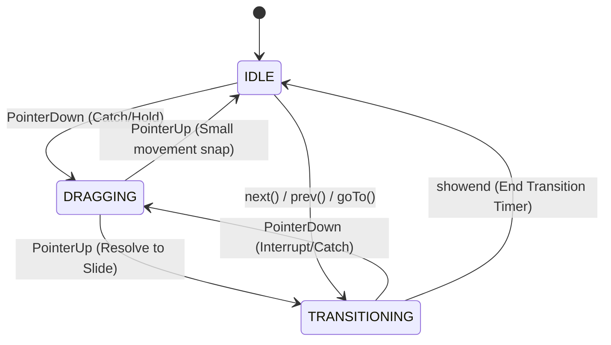

# VentoImage Next-Gen Architecture Specification ("The Bible")

> **Version**: 2.0.0-draft
> **Status**: Living Specification
> **Target**: Enterprise-grade, modular, agnostic, high-performance gallery.

---

## 1. Executive Summary & Design Philosophy

VentoImage Next-Gen is not just a refactor; it is a paradigm shift from "jQuery-style" plugin architecture to a **Reactive, State-Driven System**.

### 1.1 Core Tenets

1.  **Truth is Immutable**: The `State` object is the single source of truth. The UI is merely a projection of this state.
2.  **Renderer Agnosticism**: The Core logic does not know _how_ to draw. It delegates to a `Renderer` (DOM, WebGL, Canvas). This is non-negotiable for future GLSL support.
3.  **Physics-First**: Interactions are driven by a continuous physics simulation (springs/decay), not fixed CSS transitions, ensuring a "native-app" feel.
4.  **Composition over Inheritance**: Features are added via distinct Modules/Plugins, not by extending a massive Base class.

---

## 2. Directory Structure & Module Map

The codebase is organized by **Domain**, not by file type.

```text
src/
├── core/                       # The Nervous System
│   ├── Vento.ts                # Main Facade (Public API)
│   ├── Events.ts               # Typed Event Bus
│   ├── Options.ts              # Configuration Merging/Validation
│   └── Lifecycle.ts            # Mount/Unmount Orchestration
├── state/                      # The Brain (Data Layer)
│   ├── Store.ts                # Observable State Container
│   ├── Actions.ts              # Action Creators (Intent)
│   ├── Reducers.ts             # State Mutations (Implementation)
│   └── Selectors.ts            # Memoized Data Derivation
├── engine/                     # The Physics Engine
│   ├── Time.ts                 # RAF Loop & Delta Time
│   ├── Math.ts                 # Lerp, Clamp, Damp helpers
│   └── Scroller.ts             # Kinetic Physics Solver
├── input/                      # The Senses
│   ├── Tracker.ts              # Unified Pointer Logic (Mouse/Touch)
│   ├── Gestures.ts             # Higher-level gestures (Pinch/Tap)
│   └── Keyboard.ts             # A11y & Shortcuts
├── renderers/                  # The Face (Presentation)
│   ├── types.ts                # The Contract (Renderer Interface)
│   ├── index.ts                # Main export entry
│   ├── slide/                  # Primary Slide View
│   │   ├── SlideRenderer.ts
│   │   └── SnapPhysics.ts
│   └── thumbnails/             # Navigation Bar
│       ├── ThumbnailsRenderer.ts
│       └── FreeScrollPhysics.ts
├── plugins/                    # The Features (Plugins)
│   ├── interface.ts            # Base Interface
│   ├── standard/               # Default built-in plugins
│   │   ├── autoplay.ts
│   │   ├── fullscreen.ts
│   │   ├── keyboard.ts
│   │   ├── touch.ts
│   │   └── video.ts
└── utils/                      # Shared Helpers
    ├── dom.ts
    ├── browser.ts
    └── types.ts
```

---

## 3. The State Layer (The Brain)

We typically use a Redux-like pattern but simplified for performance (no massive switch statements, just pure reducers).

### 3.1 State Interface

This is the "god object" definition. Every pixel on screen is determined by values here.

```typescript
export interface GalleryState {
  // --- Identification ---
  id: string; // Unique instance ID

  // --- Configuration Snapshot ---
  config: DeepReadonly<VentoOptions>;

  // --- Data Model ---
  items: GalleryItem[]; // The playlist
  total: number; // items.length

  // --- Playback State ---
  currentIndex: number; // The target index (integer)
  targetIndex: number; // Where we are animating towards

  // --- Physics State ---
  position: number; // Actual float position (e.g. 2.5 = halfway between slide 2 and 3)
  velocity: number; // Current scroll speed
  status: 'IDLE' | 'TRANSITIONING' | 'DRAGGING'; // High-level machine state
  isLocked: boolean; // Interaction disabled?

  // --- Viewport Metrics ---
  width: number; // Container width
  height: number; // Container height
  pixelRatio: number; // window.devicePixelRatio (crucial for WebGL)

  // --- Media State ---
  loadedIndices: Set<number>; // Which images are loaded
  errorIndices: Set<number>; // Which images failed

  // --- Module States ---
  zoom: {
    active: boolean;
    level: number;
    x: number;
    y: number;
  };
  video: {
    playing: boolean;
    muted: boolean;
    volume: number;
    time: number;
  };
  fullscreen: {
    active: boolean;
    native: boolean; // Using API or CSS fallback
  };
}

export interface GalleryItem {
  id: string;
  type: 'image' | 'video' | 'html';
  src: {
    thumb: string;
    full: string;
    xxl?: string; // Seamless high-res upgrade
  };
  meta: {
    alt: string;
    caption?: string;
    width?: number;
    height?: number;
  };
  // For WebGL textures
  _texture?: WebGLTexture;
}
```

### 3.2 The Store

The store wraps the state and manages basic subscriptions. It avoids deep exploratory equality checks for performance, relying on strict reference equality or manual dirty flags.

```typescript
export class Store {
  private _state: GalleryState;
  private _listeners: Set<(state: GalleryState, prev: GalleryState) => void>;

  constructor(initial: GalleryState) {
    this._state = Object.freeze(initial);
    this._listeners = new Set();
  }

  public get state() {
    return this._state;
  }

  /**
   * The ONLY way to change state.
   * @param reducer used to calculate new state
   */
  public dispatch(action: Action): void {
    const nextState = rootReducer(this._state, action);
    if (nextState !== this._state) {
      const prev = this._state;
      this._state = Object.freeze(nextState);
      this.notify(nextState, prev);
    }
  }

  private notify(next: GalleryState, prev: GalleryState) {
    this._listeners.forEach((fn) => fn(next, prev));
  }
}
```

---

## 4. The Core Architecture (The Nervous System)

### 4.1 The Vento Facade

The `Vento` class is the conductor. It initializes the subsystems but performs no logic itself.

```typescript
export class Vento {
  public readonly store: Store;
  public readonly events: EventEmitter;

  private readonly engine: PhysicsEngine;
  private readonly tracker: InputTracker;
  private renderer: Renderer;
  private modules: Map<string, Module>;

  constructor(target: HTMLElement | string, options: VentoOptions) {
    // 1. Setup Phase
    const root = resolveElement(target);
    this.events = new EventEmitter();
    this.store = new Store(createInitialState(options));

    // 2. Renderers Injection & Init
    this.stageRenderer = renderers.stage;
    this.stageRenderer.init(this.stageShaft, this.options);

    if (renderers.nav && this.options.nav) {
      this.navRenderer = renderers.nav;
      this.navRenderer.init(this.navShaft, this.options);
    } else {
      this.navRenderer = {
        init: () => {},
        update: () => {},
        setFrames: () => {},
      };
    }

    // 3. Initialize Subsystems
    this.engine = new PhysicsEngine(this.store);
    this.tracker = new InputTracker(root, this.store);

    // 4. Boot Modules
    this.use(new Gestures());
    this.use(new A11y());

    // 5. Start Loop
    this.engine.start();
  }

  /**
   * Fluent API for runtime configuration
   */
  public use(module: Module): this {
    module.mount(this);
    this.modules.set(module.name, module);
    return this;
  }
}
```

---

## 5. Input & Physics (The Engine)

### 5.1 Unified Input Tracker

We abstract Mouse, Touch, and Pointer events into a single stream of `Input` actions. This handles differences in browser implementations.

**Key Responsibilities:**

- Normalizing `details.x/y` coordinates.
- Calculating `delta` and `velocity` (pixels/ms).
- Handling `PointerCancel` (crucial for scroll jank prevention).
- Detecting intent (Scroll vs Swipe).

```typescript
// input/Tracker.ts logic flow
onPointerDown(e) {
   dispatch({ type: 'DRAG_START', x: e.x });
}

onPointerMove(e) {
   if (isScrollingVertically) return; // Allow page scroll
   e.preventDefault();
   dispatch({ type: 'DRAG_MOVE', x: e.x, delta: e.movementX });
}

onPointerUp(e) {
   // Calculate throw velocity
   const velocity = tracker.getVelocity();
   dispatch({ type: 'DRAG_END', velocity });
}
```

### 5.2 Physics Engine (Kinetic Scrolling)

We do NOT use CSS transitions (`transition: transform 0.3s ease`). We use a requestAnimationFrame loop that solves physics equations. This allows dragging to "catch" a moving slide without a jump (interruption).

**Equation:**
`position += velocity * deltaTime`
`velocity *= friction` (Decay)
`velocity += (target - position) * springTension` (Snap to slide)

---

## 6. Rendering System (The Face)

### 6.1 The Interface

```typescript
export interface Renderer {
  /** Setup the viewport, create canvases or divs */
  mount(): void;

  /**
   * The Render Loop.
   * Called up to 120 times per second.
   * MUST be optimized. Zero object allocations allowed here.
   */
  render(state: GalleryState, prev: GalleryState, interpolation: number): void;

  /** Handle screen resize */
  resize(width: number, height: number): void;

  /** Cleanup */
  destroy(): void;
}
```

### 6.2 Implementation Strategy (The "Modular Renderer" Pattern)

Instead of a monolithic renderer, we divide visibility into specialized components:

- **SlideRenderer**: Optimized for large images/videos with snapping physics.
- **ThumbnailsRenderer**: Optimized for many small items with free-scroll momentum.

Each renderer encapsulates its own `PhysicsStrategy` to match its specific interaction model.

**Optimization Note**:
Inside `render()`:

```typescript
// Bad
slide.style.transform = ... // Triggers Recalculate Style immediately

// Good (Batching)
requestAnimationFrame(() => {
   slides.forEach(s => s.style.transform = ...);
});
```

Actually, our `PhysicsEngine` controls the RAF, so the `render` method _is_ inside the RAF. We just apply styles.

### 6.3 WebGL Renderer Strategy (The Future)

This is why we need the architecture.

- **Scene**: A simple quad covering the viewport.
- **Shaders**: A Fragment Shader that accepts two textures (`uCurrent`, `uNext`) and a `uProgress` float.
- **Texture Management**:
  - We cannot upload 100 images to GPU.
  - We maintain a LRU (Least Recently Used) cache of 3-5 WebGLTextures.
  - `state.loadedIndices` drives the texture pre-loading.

**Shader Interface (GLSL):**

```glsl
uniform float uProgress;     // 0.0 to 1.0
uniform float uDirection;    // -1 or 1
uniform sampler2D uTexCurrent;
uniform sampler2D uTexNext;
uniform float uDistortionStrength;

void main() {
   // Mix logic here
   // This allows liquid, fold, cube, fade, dissolve effects
}
```

---

## 7. The Plugin Architecture

Plugins are powerful extensions that can inject logic and UI.

```typescript
export interface Module {
  name: string;
  /** Called on init */
  mount(instance: Vento): void;
  /** Called on every render frame - allows plugins to hook into animation loop */
  update?(deltaTime: number): void;
  /** Cleanup */
  unmount?(): void;
}
```

### Example: The Video Plugin

The Core knows nothing about YouTube/Vimeo. The Video Plugin:

1.  Listens to `SLIDE_CHANGE`.
2.  Checks `state.items[index].type === 'video'`.
3.  Injects an iframe or `<video>` tag over the image.
4.  Manages Autoplay pausing (dispatches `AUTOPLAY_PAUSE`).

---

## 8. Accessibility (A11y) Engine

Accessibility is a core module, not an afterthought.

- **Role Management**: `role="region"`, `aria-roledescription="carousel"`.
- **Live Regions**: `aria-live` politeness toggling (off during rapid interactions, polite when settled).
- **Focus Management**: Keys (Tab) should focus visible interactive elements only.

**Interaction Model:**

- **Tab**: Enters the gallery controls.
- **Arrows**: Dispatch `PREV/NEXT` actions.
- **Enter/Space**: Select or Zoom.

---

## 9. Performance & Memory Budget

### 9.1 Asset Loading Strategy (LH Algorithm)

We implement a "Look-Ahead" priority queue.
If (Current = 5), Priority is:

1.  5 (Critical)
2.  6 (Next)
3.  4 (Prev)
4.  7-10 (Future)

**Adaptive Loading**:

- If `navigator.connection.saveData` is true, disable preloading of 4-10.
- If (FPS < 30), cancel pending low-pri network requests.

### 9.2 Object Pooling

For the Physics engine and WebGL renderer, we avoid `new Vector2()` in the loop.
We use static cached vectors to prevent Garbage Collection (GC) pauses (Jank).

```typescript
// utils/Memory.ts
export const TEMP_VEC2 = new Float32Array(2);
export const TEMP_MATRIX = new Float32Array(16);
```

---

## 10. Public API Specification

This is what definitions files (`.d.ts`) will look like.

### 10.1 Configuration Options

```typescript
interface VentoOptions {
  /** Selector or Element to mount into */
  target: string | HTMLElement;

  /** Array of media items */
  items: GalleryItem[];

  /** Layout Mode */
  layout?: 'fill' | 'contain';

  /** Navigation Modules */
  controls?: {
    arrows?: boolean;
    dots?: boolean;
    thumbnails?: boolean;
  };

  /** Rendering Engine */
  renderer?: 'dom' | 'webgl';

  /** GLSL specific config (ignored if renderer=dom) */
  glsl?: {
    effect: 'fade' | 'liquid' | 'cube';
    intensity: number;
  };
}
```

### 10.2 Events

The system emits strictly typed events.

```typescript
type Events = {
  init: void;
  destroy: void;
  'slide:change': { index: number; item: GalleryItem };
  'slide:settle': { index: number };
  'drag:start': { x: number; y: number };
  'drag:end': { velocity: number };
  'video:play': { id: string };
  error: { code: number; message: string };
};
```

---

## 11. Testing Strategy

1.  **Unit Tests (Vitest)**:
    - Test Reducers (Pure functions). `(state, action) => newState`.
    - Test Physics Math (deterministic input/output).
2.  **Integration Tests (Cypress/Playwright)**:
    - Mount component.
    - Simulate Swipe.
    - Assert pixel offset.
3.  **Visual Regression**:
    - Snapshot image at frame 0 and frame N.

---

## 12. Migration Guide (Internal)

To migrate from `src/main.ts`:

1.  Create `src/state` and define the `GalleryState` interface. This is the bedrock.
2.  Move `Options` parsing to `src/core/Options.ts`.
3.  Extract `StageRenderer` class to `src/renderers/dom/Stage.ts`.
4.  Re-write the event listeners in `main.ts` to dispatch Actions to the new Store.
5.  Delete `main.ts` and replace with `src/core/Vento.ts` that wires the new components.

---

## Appendix A: GLSL Shader Standard

All transition shaders must implement this signature to be pluggable.

```glsl
// transitions/base.glsl
vec4 transition(vec2 uv) {
  // uProgress 0->1
  return mix(
    getFromColor(uv),
    getToColor(uv),
    uProgress
  );
}
```

---

## Appendix B: State Machine Diagram

The Gallery follows a strict state machine via `GalleryStatus`. Physics simulation runs continuously but is steered by these high-level states.



### Transition Descriptions:

- **Catch/Interrupt**: `pointerdown` immediately halts the physics loop (`stop()`) and switches the status to `DRAGGING`.
- **Resolve**: On `pointerup`, the system calculates the landing target. If a significant move/swipe occurred, it triggers a state change to `TRANSITIONING`.
- **Snap**: If the movement was negligible, it snaps back to the nearest slide and returns to `IDLE`.
- **Timeout**: `TRANSITIONING` is a temporary state that automatically reverts to `IDLE` after `transitionDuration` via the `END_TRANSITION` action.
