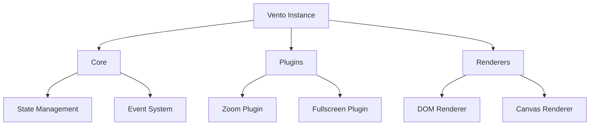
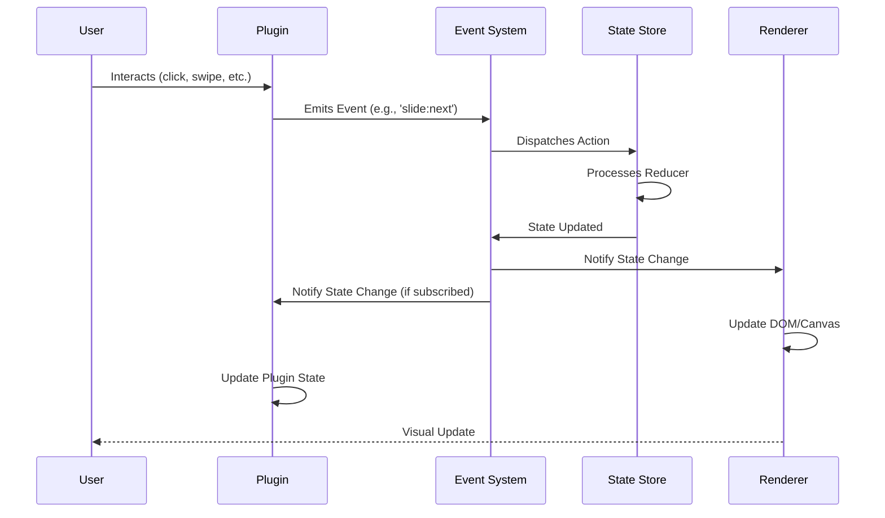
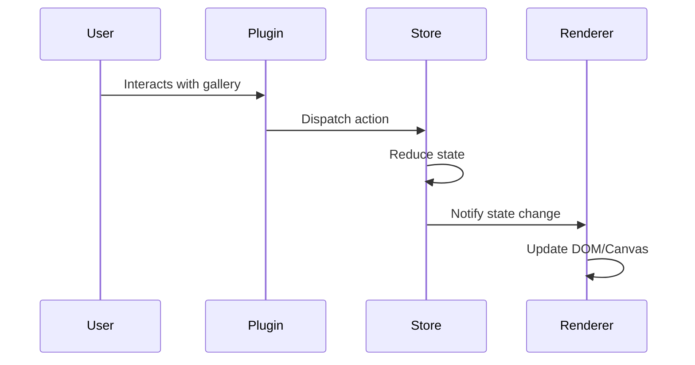

# VentoImage Architecture

## Table of Contents

1. [Core Architecture](#1-core-architecture)
2. [Plugin System](#2-plugin-system)
3. [State Management](#3-state-management)
4. [Rendering Pipeline](#4-rendering-pipeline)
5. [Performance Optimization](#5-performance-optimization)
6. [API Design](#6-api-design)
7. [Integration Points](#7-integration-points)
8. [Future Extensions](#8-future-extensions)

## 1. Core Architecture

### 1.1 High-Level Overview



### 1.2 Event Flow



#### Key Events:

1. **User Interaction Events**
   - `slide:next` - Request next slide
   - `slide:prev` - Request previous slide
   - `slide:go` - Go to specific slide (payload: `{ index: number }`)
   - `zoom:in` / `zoom:out` - Zoom controls
   - `zoom:reset` - Reset zoom to default
   - `zoom:level` - Set specific zoom level (payload: `{ level: number }`)
   - `fullscreen:toggle` - Toggle fullscreen mode
   - `fullscreen:enter` - Enter fullscreen
   - `fullscreen:exit` - Exit fullscreen
   - `play` - Start slideshow
   - `pause` - Pause slideshow
   - `stop` - Stop slideshow

2. **State Change Events**
   - `state:changed` - Emitted after any state update (payload: `VentoState`)
   - `slide:changed` - When slide changes (payload: `{ index: number, previousIndex: number }`)
   - `zoom:changed` - When zoom level changes (payload: `{ level: number, x: number, y: number }`)
   - `resize` - On viewport resize (payload: `{ width: number, height: number }`)
   - `orientation:change` - When device orientation changes (payload: `{ angle: number, type: 'portrait'|'landscape' }`)
   - `load:start` - When asset starts loading
   - `load:end` - When asset finishes loading
   - `load:error` - When asset fails to load (payload: `Error`)

3. **Lifecycle Events**
   - `init` - After instance creation, before initialization
   - `ready` - When DOM is ready and all assets are loaded
   - `destroy` - Before instance destruction
   - `error` - On errors (payload: `Error`)
   - `update` - After any update cycle completes
   - `render` - Before render cycle starts
   - `rendered` - After render cycle completes

4. **Touch/Gesture Events**
   - `touch:start` - When touch interaction begins
   - `touch:move` - During touch movement
   - `touch:end` - When touch interaction ends
   - `swipe:left` / `swipe:right` - On swipe gestures
   - `pinch:start` / `pinch:move` / `pinch:end` - For pinch-zoom gestures
   - `double:tap` - On double tap

5. **Media Events**
   - `video:play` - When video starts playing
   - `video:pause` - When video is paused
   - `video:end` - When video ends
   - `video:timeupdate` - On video time update
   - `video:volumechange` - On volume change
   - `video:error` - On video error

6. **UI Events**
   - `overlay:show` - When overlay is shown
   - `overlay:hide` - When overlay is hidden
   - `caption:show` - When caption is shown
   - `caption:hide` - When caption is hidden
   - `thumbnail:show` - When thumbnail is shown
   - `thumbnail:hide` - When thumbnail is hidden

7. **Plugin Events**
   - `plugin:load` - When a plugin is loaded
   - `plugin:error` - When a plugin fails to load
   - `plugin:init` - When a plugin is initialized
   - `plugin:destroy` - When a plugin is destroyed

### 1.3 Directory Structure

```
src/
├── core/                 # Core functionality
│   ├── vento.ts          # Main class
│   ├── constants/        # Application constants
│   └── utils/            # Utility functions
├── plugins/              # Plugin system
│   ├── plugin-manager.ts
│   └── builtin/          # Built-in plugins
├── renderers/            # Rendering logic
│   ├── dom-renderer.ts
│   └── canvas-renderer.ts
├── state/                # State management
│   ├── store.ts
│   └── actions.ts
└── types/                # TypeScript types
```

## 2. Event System

### 2.1 Event Lifecycle

1. **Event Emission**
   - Triggered by user actions or system events
   - Can be cancelled by plugins (e.g., `event.preventDefault()`)

2. **State Update**
   - Actions are processed by reducers
   - State updates are batched for performance
   - Immutable updates ensure predictable state

3. **Notification Phase**
   - Subscribers are notified of state changes
   - Order: Core → Plugins → Renderers
   - Async updates are scheduled via `requestAnimationFrame`

#### 2.1.1 Event Subscription

```typescript
// Subscribe to events
ventor.on('slide:changed', (state) => {
  console.log('Slide changed to:', state.currentIndex);
});

// Emit custom events
ventor.emit('custom:event', { data: 'custom data' });

// Remove listener
const handler = () => {};
ventor.on('event', handler);
ventor.off('event', handler);
```

## 3. Plugin System

### 2.1 Plugin Architecture

```typescript
interface VentoPlugin {
  name: string;
  version: string;
  install(instance: Vento, options?: object): void;
  destroy?(): void;
}

// Example plugin
class ZoomPlugin implements VentoPlugin {
  name = 'zoom';
  version = '1.0.0';

  install(instance: Vento) {
    // Plugin initialization
  }

  destroy() {
    // Cleanup
  }
}
```

### 2.2 Built-in Plugins

| Plugin     | Description              | Dependencies |
| ---------- | ------------------------ | ------------ |
| Zoom       | Image zoom functionality | Core, Events |
| Fullscreen | Fullscreen mode          | Core, DOM    |
| Thumbnails | Thumbnail navigation     | Core, DOM    |
| Keyboard   | Keyboard navigation      | Core, Events |
| Touch      | Touch gestures           | Core, Events |

## 4. State Management

### 3.1 State Structure

```typescript
interface VentoState {
  // Current slide index
  currentIndex: number;

  // Total number of slides
  totalSlides: number;

  // Viewport dimensions
  viewport: {
    width: number;
    height: number;
  };

  // Plugin states
  plugins: {
    [key: string]: any;
  };
}
```

### 3.2 State Updates



## 5. Rendering Pipeline

### 4.1 Render Flow

1. State change detected
2. Calculate new layout
3. Batch DOM updates
4. Apply transitions/animations
5. Trigger post-render hooks

### 4.2 Performance Considerations

- **Virtual DOM**: For efficient updates
- **RequestAnimationFrame**: For smooth animations
- **OffscreenCanvas**: For WebGL/Canvas rendering
- **Intersection Observer**: For lazy loading

## 6. Performance Optimization

### 5.1 Bundle Optimization

- Code splitting
- Tree shaking
- Dynamic imports for plugins

### 5.2 Runtime Performance

- Debounced resize handling
- Image preloading
- Memory management

## 7. API Design

### 6.1 Public API

```typescript
interface VentoOptions {
  // Core options
  selector: string | HTMLElement;
  items: string[] | HTMLElement[];

  // Navigation
  nav: boolean | 'thumbs' | 'dots' | 'both';
  arrows: boolean;

  // Behavior
  loop: boolean;
  autoplay: boolean | number;

  // Callbacks
  onInit?: () => void;
  onChange?: (index: number) => void;
}

// Usage
new Vento({
  selector: '.gallery',
  items: ['image1.jpg', 'image2.jpg'],
  nav: 'thumbs',
  loop: true,
});
```

## 8. Integration Points

### 7.1 E-commerce Platforms

- Magento
- Shopify
- WooCommerce
- BigCommerce

### 7.2 Framework Integrations

- React
- Vue
- Angular
- Web Components

## 9. Future Extensions

### 8.1 WebAssembly Modules

- Image processing
- Advanced animations

### 8.2 AI Features

- Smart cropping
- Auto-tagging
- Content-aware layout

### 8.3 3D/AR Support

- WebGL renderer
- AR view integration
- 3D model viewer

---

_Last Updated: December 2025_

This document serves as a living document for the VentoImage architecture. Please update it as the architecture evolves.
